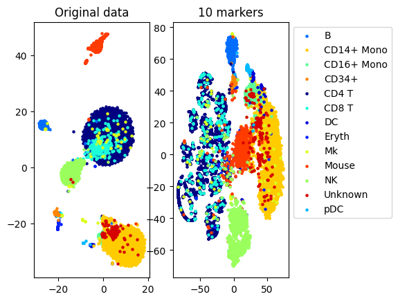
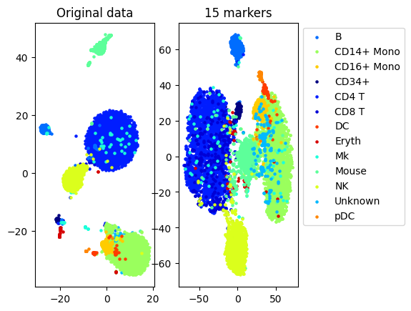
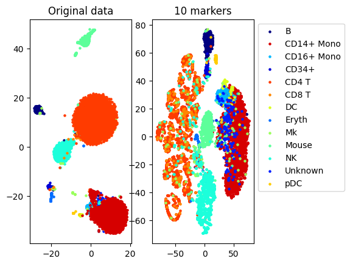
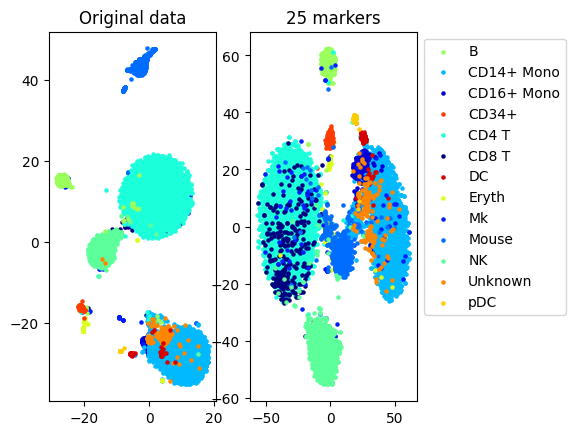
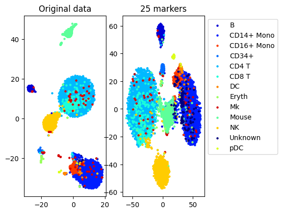
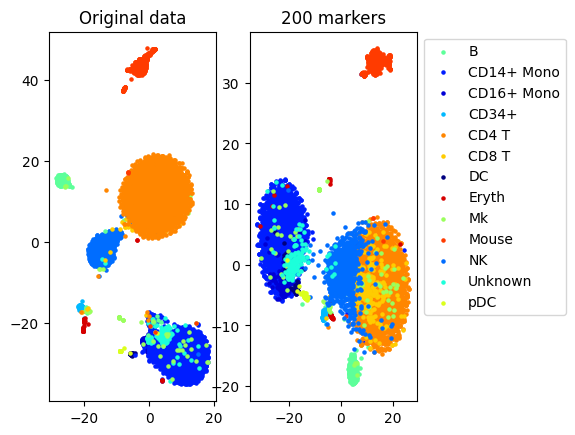

# Dokumentacija završnog praktičnog projekta  
### Problem selekcije marker gena  
Studentice: Larisa Darojković, Katarina Jurić  
Mentor: dr. sc. Luka Borozan

## Uvod
Problem selekcije marker gena govori o procesu identificiranja specifičnih gena ili genetskih markera koji su važni za razlikovanje različitih bioloških stanja, kao što su npr. različite vrste stanica. Ovaj problem se često pojavljuje kod analize podataka iz genetskih studija, poput onih koji koriste sekvenciranje RNA.  
  
Cilj selekcije je izabrati najmanji mogući skup gena (markera) koji mogu razlikovati različite stanice s visokom preciznošću. Problem zahtjeva sofisticirane statičke i računalne metode za selekciju, zbog velikog broja gena (markera), a relativnog malog broja uzoraka.  
  
U nastavku pomoću alata scGeneFit, koji je razvijen za riješavanje problema selekcije markera gena, prikazat ćemo naše rezultate za riješavanja ovoga problema na CITEseq dataset-u.
  
## Linearno programiranje
Linearno programiranje je metoda za rješavanje složenih problema iz stvarnog života koristeći se matematikom. Koristi se kak bi optimizirale operativnu učinkovitost, tj. izvukle najviše vrijednosti iz ograničenih resursa.
  
### Gurobi
Gurobi je napredan softverski alat namijenjen za optimizaciju, on omogućuje rješavanje složenih matematičkih problema optimizacije s visokom efikasnošću i brzinom.Koristi se u raznim znanstevenim i industrijskim područjima (npr. financijama, logistici, energetici), gdje je potrebno naći optimalna riješenja unutar zadanih ograničenja.  

Gurobi podržava više vrsta optimizacije, kao što je linearno programiranje pomoću kojega mi rješavamo naš problem.
  
### Zadatak 1.6

Riješite sljedeći problem uvjetne optimizacije:

$$
x_1^2 + x_2^2 + x_3^2 \rightarrow \min\limits_{x_1, x_2, x_3}
$$


uz uvjete:

$$
x_1 + x_2 + x_3 = 1
$$

$$
x_1 - x_2 = 0
$$


 ```python
from gurobipy import *
Model()

opt_mod = Model(name = "Zad 1.6.")

x1 = opt_mod.addVar(name = 'x1', vtype = GRB.CONTINUOUS, lb = 0)
x2 = opt_mod.addVar(name = 'x2', vtype = GRB.CONTINUOUS, lb = 0)
x3 = opt_mod.addVar(name = 'x3', vtype = GRB.CONTINUOUS, lb = 0)

obj_fn = pow(x1, 2) + pow(x2, 2) + pow(x3, 2)
opt_mod.setObjective(obj_fn, GRB.MINIMIZE)

c1 = opt_mod.addConstr(x1 + x2 + x3 == 1, name = 'c1')
c2 = opt_mod.addConstr(x1 - x2 == 0, name = 'c2')

opt_mod.optimize()
opt_mod.write("Zad16.lp")

print('Objective Function Value: %f' % opt_mod.ObjVal) 
for v in opt_mod.getVars():
    print('%s: %g' % (v.VarName, v.x))
```

```
Objective Function Value: 0.333333
x1: 0.333333
x2: 0.333333
x3: 0.333333
```

## scGeneFit

Python kod za selekciju genetičkih markera korištenjem linearnog programiranja pomoću Gurobi optimizatora.

Primjeri i kod: [https://github.com/jurick1910/Zavr-ni-prakti-ki-projekt] po uzoru na algoritam opisan u [https://www.biorxiv.org/content/10.1101/599654v1](https://www.biorxiv.org/content/10.1101/599654v1) i riješen u  [https://github.com/solevillar/scGeneFit-python].

Glavna funkcija paketa je scGeneFit.functions.get_markers()

``` python
def get_markers(data, labels, num_markers, method='pairwise', epsilon=1, sampling_rate=1, n_neighbors=3, verbose=True)
```
- data: Nxd numpy niz s koordinatama točaka, gdje je N broj točaka, a d dimenzija
- labels: lista s oznakama (N oznaka, jedna za svaku točku)
- num_markers: ciljani broj markera, koje treba odabrati (broj markera < d)
- method='pairwise': uzima u obzir ograničenja koja zahtjevaju da točke iz različitih klasa budu razdvojene minimalnom udaljenosti nakon projekcije na odabrane markera. U ovoj metodi se ograničenja nasumično oadbiru (sampling_rate) i ograničavaju (n_neighbors, random_max_constraints)
- epsilon: ograničenje će biti oblika expr > Delta, gdje je Delta jednaka epsilon puta norma najmanjeg ograničenja (default 1), najvažniji parametar, određuje opseg ograničenja, a ostali parametri određuju samo veličinu LP-a kako bi se prilgodili ograničenim računalnim resursima.
- sampling_rate: odabire ograničenja iz nasumičnog uzroka s proporcijom samplin_rate (default 1)
- n_neighbors: bira ograničenja iz n najbližih susjeda (default 3) 
- verbose=True: Hoće li se ispisivati informacije poput veličine LP-a ili proteklog vremena (default True).


```python
    random_max_constraints = random.randint(1, constraints.shape[0])
```
- broj ograničenja je nasumičan između 1 i broja pojedinačnih ograničenja koja su deifnirana.
  
  
 ```Python
def __lp_markers(constraints, num_markers, epsilon):
    m, d = constraints.shape
    c = np.concatenate((np.zeros(d), np.ones(m)))
    l = np.zeros(d + m)
    u = np.concatenate((np.ones(d), np.array([float('inf') for i in range(m)])))
    aux1 = np.concatenate((constraints, -np.identity(m)), axis=1)
    aux2 = np.concatenate((np.ones((1, d)), np.zeros((1, m))), axis=1)
    A = np.concatenate((aux1, aux2), axis=0)
    b = np.concatenate((-epsilon * np.ones(m), np.array([num_markers])))
    
    model = gp.Model()
    x = model.addVars(d + m, lb = l, ub = u, name = "x")
    model.addConstrs((gp.quicksum(A[i, j] * x[j] for j in range(d + m)) == b[i] for i in range(m + 1)), name = "constraints")
    model.setObjective(gp.quicksum(c[i] * x[i] for i in range(d + m)), gp.GRB.MINIMIZE)
    model.optimize()
    return {"x": [x[i].x for i in range(d + m)]}
```

- problem selekcije marker gena rješavamo preko __lp_markers, koji smo prilagodili za Gurobi optimizator
  
## Rezultati
```Python
from scGeneFit.functions import *

%matplotlib inline
import numpy as np
np.random.seed(0) 
```
### Auxiliary functions
``` Python
from sklearn.neighbors import NearestCentroid
clf=NearestCentroid()

def performance(X_train, y_train, X_test, y_test, clf):
    clf.fit(X_train, y_train)
    return clf.score(X_test, y_test)
```
### CITEseq primjer
Data included in package, from 

[1] Marlon Stoeckius, Christoph Hafemeister, William Stephenson, Brian Houck-Loomis, Pratip K Chattopadhyay, Harold Swerdlow, Rahul Satija, and Peter Smibert. 
Simultaneous epitope and transcriptome measurement insingle cells. Nature Methods, 14(9):865, 2017.

``` Python
#load data from files
[data, labels, names]= load_example_data("CITEseq")
N,d=data.shape
```
#### Use of scGeneFit (pairwise distance constraints)

``` Python
num_markers=25
method='pairwise'
sampling_rate=0.1 #use 10 percent of the data to generate constraints
n_neighbors=3 #3 constraints per point
epsilon=1 #Delta is 10*norm of the smallest constraint

markers= get_markers(data, labels, num_markers, method=method, sampling_rate=sampling_rate,
                     n_neighbors=n_neighbors, epsilon=epsilon)

accuracy=performance(data, labels, data, labels, clf)
accuracy_markers=performance(data[:,markers], labels, data[:,markers], labels, clf)

print("Accuracy (whole data,", d, " markers): ", accuracy)
print("Accuracy (selected", num_markers, "markers)", accuracy_markers)
```
```
Solving a linear program with 500 variables and 1282 constraints
Set parameter Username
Academic license - for non-commercial use only - expires 2025-05-09
Warning for adding constraints: zero or small (< 1e-13) coefficients, ignored
Gurobi Optimizer version 11.0.0 build v11.0.0rc2 (win64 - Windows 11+.0 (22631.2))

CPU model: AMD Ryzen 5 5500U with Radeon Graphics, instruction set [SSE2|AVX|AVX2]
Thread count: 6 physical cores, 12 logical processors, using up to 12 threads

Optimize a model with 1283 rows, 1782 columns and 553823 nonzeros
Model fingerprint: 0x8f6213f0
Coefficient statistics:
  Matrix range     [3e-13, 1e+00]
  Objective range  [1e+00, 1e+00]
  Bounds range     [1e+00, 1e+00]
  RHS range        [9e-02, 3e+01]
Presolve time: 0.24s
Presolved: 1283 rows, 1782 columns, 553794 nonzeros

Concurrent LP optimizer: primal simplex, dual simplex, and barrier
Showing barrier log only...

Ordering time: 0.06s

Barrier statistics:
...
Optimal objective  7.187322849e+01
Time elapsed: 68.34522414207458 seconds
Accuracy (whole data, 500  markers):  0.8660786816757572
Accuracy (selected 25 markers) 0.7912266450040617
Output is truncated. View as a scrollable element or open in a text editor. Adjust cell output settings...
```

``` Python
#TSNE plot
a=plot_marker_selection(data, markers, names)
```
```
Computing TSNE embedding
Elapsed time: 73.77150392532349 seconds
```
```

```
#### One vs all markers

```Python
markers2=one_vs_all_selection(data,labels)

accuracy=performance(data, labels, data, labels, clf)
accuracy_markers=performance(data[:,markers2], labels, data[:,markers2], labels, clf)

print("Accuracy (whole data,", d, " markers): ", accuracy)
print("Accuracy (selected", num_markers, "markers)", accuracy_markers)
```
```
Accuracy (whole data, 500  markers):  0.8660786816757572
Accuracy (selected 25 markers) 0.7537426018335848
```

 ```Python
a=plot_marker_selection(data, markers2, names)
```
```
Computing TSNE embedding
Elapsed time: 73.00219750404358 seconds
```
  
## Zaključak  
Iz gore dobivenih podataka možemo uočiti nekoliko ključnih zaključaka. Točnost modela raste s brojem odabranih markera, ali nakon određene točke dodatni markeri više ne poboljšavaju značajno točnost. Iz toga možemo vidjeti da uz povećanje broja ograničenja točnost (accuracy) je preciznija te je vrijeme izvršavanja (time elapsed) duže. 

Optimizacija broja markera je ključna jer manji broj markera može osigurati visoku točnost uz manju računalnu složenost. Broj ograničenja izravno utječe na vrijeme obrade, pa je važno pronaći ravnotežu između točnosti i brzine izvršavanja. Iako se može činiti da više markera znači bolje rezultate, bitnije je pronaći optimalan broj koji pruža najbolji omjer između točnosti i složenosti. Optimizacijom parametara kao što su n_neighbors i sampling_rate možemo dodatno smanjiti vrijeme obrade bez gubitka točnosti. 

### Maksimalan broj ograničenja n = random.randint(1, constraints.shape[0])

| Number of markers | Number of constraints | Accuracy          | Time elapsed (seconds) |
|-------------------|-----------------------|-------------------|------------------------|
| 10                | 1000                  | 0.7154462109782987| 47.69971990585327       |
| 10                | 5185                  | 0.7286758732737612| 816.5600554943085       |
| 15                | 8831                  | 0.7759080886619473| 1993.14790391922        |
| 15                | 9600                  | 0.7759080886619473| 2448.438935995102       |
| 25                | 4036                  | 0.7893698502959267| 607.1790144443512       |
| 25                | 9829                  | 0.7949402344203319| 3266.6842024326324      |
| 50                | 2233                  | 0.8237205523964257| 160.27630376815796      |
| 50                | 5729                  | 0.8131600324939074| 913.4680142402649       |
| 200               | 892                   | 0.8456539398862714| 40.49279451370239       |
| 200               | 3689                  | 0.8478588836021818| 617.2766561508179       |
  


  










